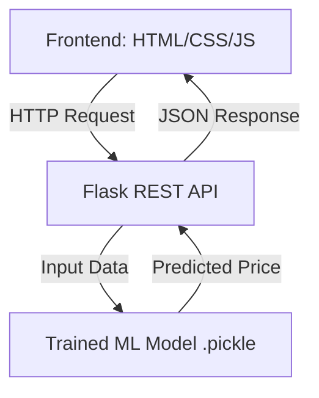

# 🏠 Bengaluru Property Estimator

**An end-to-end Machine Learning Web Application that predicts real estate prices in Bengaluru with ~84% cross-validated accuracy.**

 

## 📝 Overview
Buying a home is a life-changing decision, but property pricing is often unclear and inconsistent. This project addresses that problem by using **Data Science and Machine Learning** to estimate realistic market prices for residential properties in Bengaluru.

The model is trained on historical housing data and captures key real-estate factors such as location trends, total square footage, BHK, and bathroom distribution, providing reliable price predictions through a user-friendly web interface.

## 🚀 Key Features
* **Smart Valuation Engine:** Predicts property prices using Linear Regression based on Location, SqFt, BHK, and Bathrooms.
* **Domain-Aware Logic:** Incorporates real-world housing insights. For example, the model understands that a 1 BHK with 1000 sqft reflects luxury and may be valued differently than a cramped 3 BHK of the same size.
* **Robust Data Cleaning:** Handles complex outliers, such as removing homes with impossible configurations (e.g., 4000 sqft homes with 1 bedroom or illogical bathroom counts).
* **Real-Time Predictions:** A Flask REST API serves predictions instantly to a clean, responsive frontend.

## 🧠 Data Science Pipeline
1.  **Exploratory Data Analysis (EDA):** Analyzed price distributions, location impact, and sqft-price relationships to identify anomalies.
2.  **Data Cleaning:** Applied domain-specific constraints to remove logical errors rather than just blind statistical trimming.
3.  **Feature Engineering:** Used **One-Hot Encoding** for location data and dimensionality reduction to handle rare locations.
4.  **Model Selection:** Evaluated algorithms (Linear Regression, Lasso, Decision Tree) using **GridSearchCV** and **ShuffleSplit Cross-Validation**.
5.  **Deployment:** Exported the trained model using `pickle` and built a Flask backend to serve HTTP requests.

## 📊 Model Performance

| Algorithm | Cross-Validated Score | Verdict |
| :--- | :--- | :--- |
| **Linear Regression** | **~84.5%** | **🏆 Best Performer** |
| Lasso Regression | ~68.7% | Over-regularized |
| Decision Tree | ~72.8% | Overfitting |

*Validation Strategy: 5-Fold ShuffleSplit Cross-Validation to ensure generalization.*

## 🧩 System Architecture

Launch the Frontend

Open client/app.html in your web browser.

👤 Author
Nazik - Undergraduate | Data Science & Machine Learning Enthusiast

LinkedIn Profile www.linkedin.com/in/nazikhassan11
